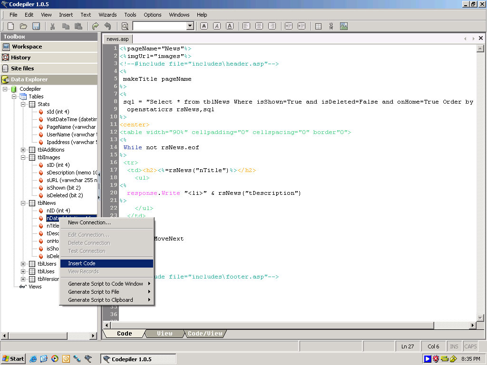



## ASP Editor \* HTML \* Web Editor \* Codepiler \* Millions of Functions

### Description

http://codepiler.com/dl/codepilersource105.zip

That is the link to download this application, I have tried 3 times to upload the source to planet source code and everytime fails. I dont know what to say, but here is the description 

I have spent over 300 hours working on this, but just recently decided to make tis open source so please dont message me about the nag screen, you can register for free and it removes the screem.

if you have any suggestions please either leave them here or in my forum, http://forums.codepiler.com and i will try to address or fix them, or add them depending on what it is.  

Please be gentle, but also vote for me if you like this, I would actually suggest going to http://codepiler.com and clicking the cnet download link on the main page to get the installer, if you get the installer and install it, then open the source all the dll's will be pre registered for you!! very easy.  <b>

Codepiler is a versatile code editor geared towards ASP/HTML design. It features a File Explorer, Multiple document mangement, History Window to keep track of all your work, Split screen coding, Intelligent Code Recognition, Color Coding, CSS Stylesheet Editor, Multiple Site Management, Live FTP File Update, Database Explorer for viewing MS Access and SQL tables. Many wizards and options for fast development and much more.</b>

**UPDATE** You can now download all source code from here
 
### More Info
 
Codepiler is a versatile code editor geared towards ASP/HTML design. It features a File Explorer, Multiple document mangement, History Window to keep track of all your work, Split screen coding, Intelligent Code Recognition, Color Coding, CSS Stylesheet Editor, Multiple Site Management, Live FTP File Update, Database Explorer for viewing MS Access and SQL tables. Many wizards and options for fast development and much more.

For the easyness, please download the installer from codepiler.com and install it to register all the dll's for you, it took me months to make this, so please dont be too harsh and remember to vote....

             |
---                |---
**Submitted On**   |2004-05-21 00:15:10
**By**             |[rBg](https://github.com/Planet-Source-Code/PSCIndex/blob/master/ByAuthor/rbg.md)
**Level**          |Advanced
**User Rating**    |5.0 (235 globes from 47 users)
**Compatibility**  |VB 4\.0 \(32\-bit\), VB 5\.0, VB 6\.0, VB Script, ASP \(Active Server Pages\) 
**Category**       |[Complete Applications](https://github.com/Planet-Source-Code/PSCIndex/blob/master/ByCategory/complete-applications__1-27.md)
**World**          |[Visual Basic](https://github.com/Planet-Source-Code/PSCIndex/blob/master/ByWorld/visual-basic.md)
**Archive File**   |[ASP\_Editor18291812142004\.zip](https://github.com/Planet-Source-Code/rbg-asp-editor-html-web-editor-codepiler-millions-of-functions__1-55112/archive/master.zip)

